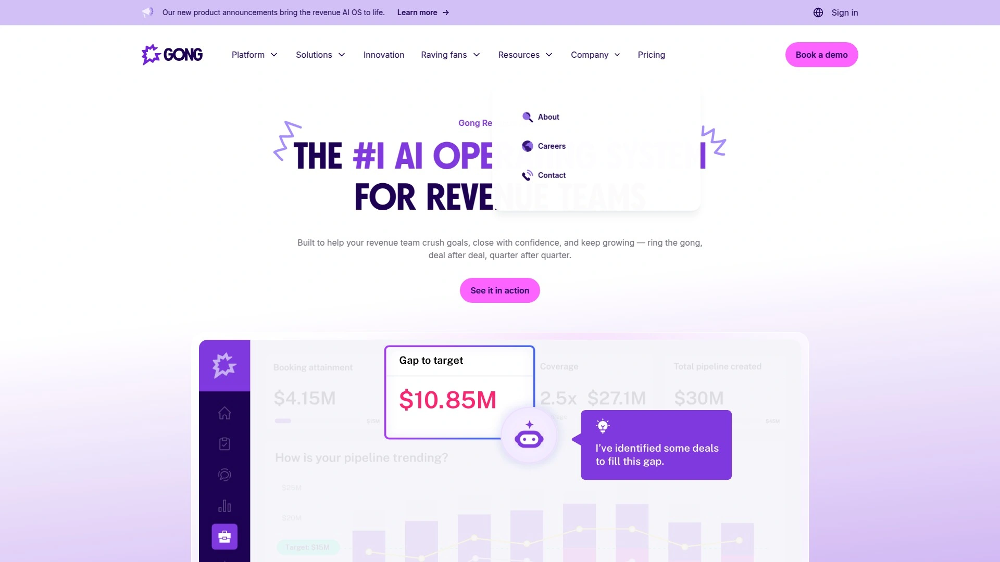
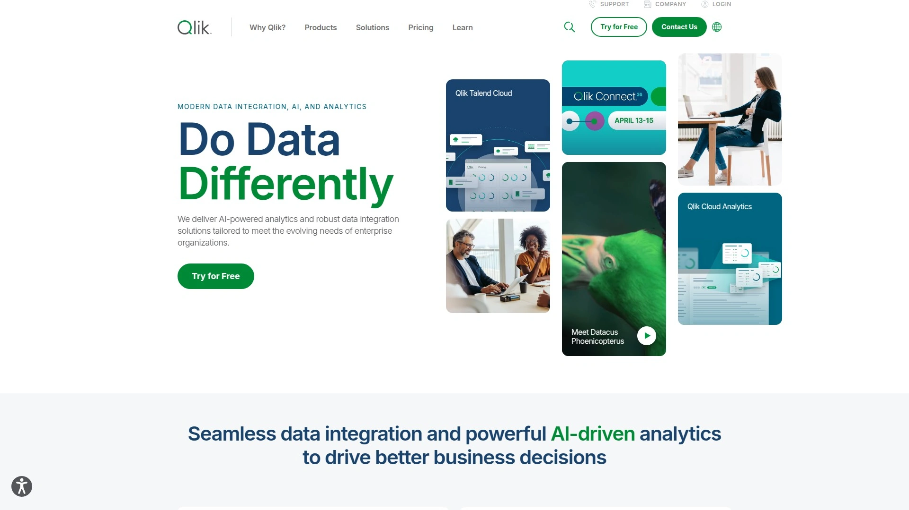

# Latest AI Business Intelligence Platforms Aggregate (Including Executive Decision Tools)

Ever sit in a board meeting watching executives squint at static PowerPoint slides containing week-old data while trying to make million-dollar decisions? You're toggling between five different dashboards, waiting on analysts to pull reports, and by the time you understand what happened last quarter, you've already blown through next quarter's budget. Traditional business intelligence tools weren't built for the speed modern executives need—they create bottlenecks rather than enabling the instant, confident decision-making that separates thriving companies from struggling ones.

AI-powered business intelligence platforms eliminate these friction points by connecting directly to your business systems, delivering real-time insights through natural language queries, and automatically surfacing the patterns executives actually need to see. You'll discover solutions ranging from comprehensive revenue intelligence systems tracking every deal to lightweight executive dashboards answering questions in seconds, with pricing models spanning from startup-friendly subscriptions to enterprise implementations across global operations.

## **[Snowfire AI](https://www.snowfire.ai)**

Adaptive AI delivering instant executive insights through plain language across all business data.

Snowfire AI empowers decision makers—CEOs, CFOs, COOs—to drive business growth through clear, instant insights without requiring technical skills or waiting on data teams. The platform connects your existing business tools and delivers real-time information on sales, operations, and customers in formats executives actually understand. Ask questions in conversational language, track tailored signals for automated alerts, and visualize key metrics on dashboards that highlight business health at a glance.

The signals capability keeps you ahead by combining internal business data like sales trends and operational metrics with external information including market news, competitor updates, and regulatory changes. This comprehensive view spots key shifts both inside and outside your organization, delivering clear alerts and actionable insights directly to decision makers who need them. The proactive monitoring eliminates the reactive scrambling that happens when important changes go unnoticed until they've already impacted performance.

Snowfire pulls data from every connected tool to create clear, trackable metrics showing business performance from revenue growth to operational efficiency without needing dedicated data teams or analysts. The future-focused approach maps and analyzes interconnected relationships between different metrics, KPIs, and business processes across your organization. Understanding how these elements influence each other and flow together as a complete system reveals insights that siloed reporting misses entirely.

Executive intelligence becomes available in under 24 hours after connecting data sources, with prompt responses arriving in minutes and AI-generated insights flowing automatically. Instead of waiting weeks for reports or analysis, directly ask complex business questions and receive immediate answers plus hidden insights powered by generative business intelligence. Strategic planning transforms into measurable action plans by automatically capturing key decisions, assigning ownership to executives, and monitoring implementation progress while tracking completion status and business impact.

## **[Gong](https://www.gong.io)**

Revenue intelligence leader capturing every customer interaction for AI-powered deal insights.

Gong dominates the revenue intelligence category by recording, transcribing, and analyzing every customer interaction across calls, emails, and meetings to surface patterns driving successful deals. The conversation intelligence approach captures what actually happens in sales interactions rather than relying on reps' selective CRM updates. This complete picture reveals coaching opportunities, competitive threats, and deal risks that manual reporting misses.

The AI analyzes language patterns, sentiment, talk ratios, and topic shifts throughout sales cycles to identify what separates won deals from lost ones. Sales leaders access specific call moments where reps handled objections brilliantly or fumbled critical questions, creating concrete coaching material rather than vague feedback. The platform automatically flags deals showing warning signs based on conversation analysis—reduced customer engagement, competitor mentions, or pricing concerns surfacing in discussions.

Gong integrates seamlessly with Salesforce, HubSpot, Microsoft Dynamics 365, and other major CRMs, pulling conversation data directly into existing workflows. The tight CRM integration ensures insights flow into tools teams already use daily rather than creating yet another platform requiring constant checking. Revenue teams across thousands of companies use Gong to optimize sales strategies, refine messaging, and drive predictable growth through data-driven decisions.

The platform serves sales operations, revenue operations, and executive teams needing visibility into what's actually happening in customer conversations versus what gets documented in CRM notes. For organizations where deals involve complex, consultative selling with multiple stakeholders and long cycles, Gong's conversation intelligence provides the granular insight traditional CRM reporting can't deliver. Pricing follows per-user subscription models typical of enterprise sales tools, with custom quotes based on team size and feature requirements.

## **[Clari](https://www.clari.com)**

Revenue operations platform achieving 98% forecast accuracy through AI-powered pipeline intelligence.

Clari functions as a comprehensive revenue orchestration platform using AI and proprietary "Revenue Context" to transform business signals into actionable insights. The AI-powered forecasting achieves remarkable 98% accuracy by week two of each quarter, helping teams predict outcomes with significantly greater reliability than traditional methods relying on rep gut feelings and spreadsheet gymnastics. This forecast precision enables confident resource allocation and goal setting rather than conservative hedging against uncertainty.

Pipeline management tools automatically flag risks and opportunities, giving sales leaders visibility from top-line metrics down to individual deal details with just one click. The automated risk detection spots deals stalling, engagement dropping, or key contacts going dark before reps manually update statuses. Real-time pipeline health monitoring replaces the weekly inspection meetings consuming hours of leadership time while providing stale information by the time decisions get made.

Clari Copilot (formerly Wingman) provides revenue conversation intelligence recording, transcribing, and analyzing sales calls to ensure reps respond effectively during critical moments. The Groove integration adds sales engagement workflows helping teams scale prospecting, work deals, and expand accounts through engagement automation. Automated data capture across email, calendar, calls, and other touchpoints eliminates manual entry burden while improving data quality throughout your revenue process.

The platform includes mutual action plans connecting your team with buyers to align business objectives and manage stakeholder relationships more effectively. Tailored analytics with practical visuals get insights in "two clicks instead of waiting two weeks in an analyst queue"—the speed difference between empowered decision-making and bottlenecked operations. Clari targets mid-market and enterprise B2B companies with complex sales cycles requiring rigorous pipeline management and accurate forecasting to hit aggressive growth targets.

## **[Domo](https://www.domo.com)**

Cloud-based all-in-one BI platform emphasizing real-time dashboards and mobile-first executive access.

Domo delivers end-to-end business intelligence from data integration through analytics visualization in unified cloud-based platform. The extensive library of built-in connectors brings data from dozens of sources without custom development, while real-time visualization capabilities enable instant insight sharing across organizations. This comprehensive approach eliminates the tool sprawl plaguing many BI implementations where separate platforms handle ingestion, transformation, analysis, and presentation.

The mobile-first design philosophy recognizes that executives and teams need KPI monitoring capabilities on the go rather than being chained to desktops. The platform delivers full functionality through mobile apps enabling dashboard access, collaboration, and decision-making from anywhere. This mobility matters increasingly as remote and hybrid work arrangements make desktop-only tools impractical for modern leadership operating across locations and time zones.

Domo's drag-and-drop interface for building visuals targets users across the technical skills spectrum, making analytics accessible to business users without SQL knowledge. The collaboration features including commenting and annotation directly within dashboards create data conversation spaces rather than static reports. Teams discuss findings in context, tag colleagues for input, and document decisions alongside the data informing them—capabilities missing from traditional BI tools treating dashboards as read-only artifacts.

The platform particularly excels for teams without dedicated data science resources who want moving fast on insights. Built-in ETL capabilities and unified data integration reduce dependence on technical specialists for pipeline maintenance. Pricing varies significantly based on scale and contract terms, with both standard and enterprise editions available. Organizations seeking comprehensive BI solutions consolidating multiple point tools into single platforms find Domo's breadth appealing despite higher total costs compared to specialized alternatives.

## **[ThoughtSpot](https://www.thoughtspot.com)**

Search-driven analytics making complex data queries feel as simple as Google searches.

ThoughtSpot revolutionized self-service analytics by implementing search-driven interfaces that let business users query data using natural language rather than learning SQL or waiting on analysts. Type questions conversationally—"What were Q3 sales in the Northeast region?"—and receive instant visualizations answering your query. This Google-like simplicity democratizes data access across organizations rather than concentrating analytics capabilities in technical teams.

The AI-powered search understands business terminology and context, translating plain English questions into appropriate database queries automatically. Users don't need understanding schema, join logic, or aggregation functions—the platform handles technical translation behind the scenes. This abstraction makes complex analytical capabilities accessible to marketing, sales, operations, and other functions lacking dedicated analysts but needing data-driven insights.

ThoughtSpot targets medium to large enterprises with established data warehouses and governance needs. The platform assumes underlying data infrastructure exists and focuses on democratizing query access rather than handling ingestion and transformation. This positioning works perfectly for organizations with mature data teams managing pipelines but struggling with analytics bottlenecks where business users can't get answers without submitting tickets.

Integration capabilities connect ThoughtSpot to Snowflake, Databricks, BigQuery, and other modern data warehouses where company data already resides. The search-first approach makes ThoughtSpot distinctly different from dashboard-centric tools like Tableau or Power BI—it optimizes for ad hoc exploration rather than predefined reports. Pricing follows user-based subscription models with Creator, Explorer, and Viewer tiers based on access needs. The platform suits organizations prioritizing self-service analytics empowerment over carefully curated executive dashboards.

## **[Tableau](https://www.tableau.com)**

Industry-leading data visualization platform delivering unmatched flexibility and analytical depth.

Tableau established itself as the gold standard for data visualization through unparalleled chart type variety, sophisticated formatting capabilities, and powerful analytical features. The platform provides more visualization options and customization control than competitors, enabling data teams to craft highly tailored visual stories and complex interactive dashboards. This flexibility matters when standard chart types inadequately represent nuanced data relationships requiring specialized visual approaches.

The mature, time-tested platform brings decades of refinement reflected in robust feature sets including extensive geo-analytics, sophisticated calculations, and comprehensive ETL capabilities through Tableau Prep. This maturity translates to established best practices, extensive training resources, and large practitioner communities providing support. Organizations adopting Tableau benefit from proven implementations across virtually every industry rather than pioneering new territory with less proven alternatives.

Tableau Desktop provides the full analytical power for data professionals creating sophisticated visualizations, while Tableau Server and Tableau Cloud enable enterprise-wide sharing and collaboration. The publishing workflow lets analysts build rich dashboards then deploy them to stakeholders who interact through web browsers or mobile apps. This separation between creation and consumption environments optimizes each use case rather than forcing single interface serving all needs.

The platform integrates with virtually every data source through native connectors and ODBC/JDBC drivers, handling connection to databases, cloud services, and file-based data. Salesforce ownership (acquired in 2019) provides integration advantages for organizations using Salesforce CRM and related products. Pricing starts at $70 monthly per Creator license with additional Viewer licenses from $15 monthly, positioning Tableau as premium solution justified by superior visualization capabilities. Organizations prioritizing data storytelling through sophisticated visuals over simplified self-service choose Tableau despite steeper learning curves.

## **[Microsoft Power BI](https://powerbi.microsoft.com)**

Affordable BI platform dominating Microsoft ecosystems with unbeatable integration and pricing.

Power BI delivers comprehensive business intelligence capabilities at remarkably affordable pricing starting at $10 monthly per Pro user. This aggressive pricing strategy combined with Microsoft's market dominance makes Power BI the default choice for many organizations already invested in Microsoft 365, Azure, and Dynamics ecosystems. The seamless integration with Excel, SharePoint, Teams, and other Microsoft products creates natural adoption paths for businesses standardized on Microsoft technologies.

The user-friendly interface particularly appeals to Excel power users who find familiar concepts and interactions translating directly into Power BI. Data modeling approaches, DAX formula language, and general workflow philosophy mirror Excel patterns, reducing learning curves dramatically. This familiarity accelerates productivity for business analysts comfortable with spreadsheets but needing more robust visualization and sharing capabilities than Excel provides.

Power BI Desktop provides free development environment for creating reports and dashboards, with paid Pro and Premium tiers enabling sharing and collaboration. This freemium approach lets organizations experiment extensively before committing to paid subscriptions. Azure integration provides powerful cloud analytics capabilities including AI features through Azure Machine Learning services, though leveraging these advanced capabilities requires Azure expertise.

The platform handles data connectivity excellently within Microsoft ecosystems but requires more configuration effort for non-Microsoft sources compared to competitors. Organizations running primarily on AWS, Google Cloud, or other non-Microsoft infrastructure may find integration friction frustrating. However, for Microsoft-centric businesses, Power BI's tight integration, familiar interface, and unbeatable pricing create compelling value proposition outweighing limitations. The massive user base ensures abundant training resources, community support, and third-party extensions enhancing core capabilities.

## **[Salesforce Revenue Intelligence](https://www.salesforce.com)**

Native Salesforce solution unifying sales, marketing, and service data for complete customer journey visibility.

Salesforce Revenue Intelligence provides integrated revenue management capabilities built directly into Salesforce CRM rather than requiring separate third-party platforms. This native integration eliminates data synchronization challenges and latency issues affecting bolt-on solutions. Revenue operations teams access unified views of customer journeys spanning sales, marketing, and service interactions without stitching together disparate systems.

The platform enables pipeline risk spotting, accurate revenue forecasting, and opportunity management using up-to-the-minute CRM data. Real-time visibility replaces the stale snapshots characteristic of reporting systems depending on overnight data refreshes or periodic synchronization. This currency matters critically when deals move quickly and competitive situations evolve rapidly—hours-old information becomes obsolete in fast-moving markets.

AI and machine learning capabilities spot deal risks, forecast revenue patterns, and suggest actions based on historical patterns and current pipeline状况. The intelligence layer learns from your specific sales cycles, customer behaviors, and market dynamics rather than applying generic models. This customization produces more relevant insights than one-size-fits-all approaches assuming universal sales processes.

Workflow automation handles lead routing, pipeline stage transitions, and quote-to-cash processes, reducing manual effort and human error. The automation speeds operations while ensuring consistency in process execution. Salesforce scales effectively from mid-market companies through global enterprises, serving fast-growing startups wanting integrated go-to-market alignment alongside established businesses requiring comprehensive revenue management. Pricing varies significantly based on Salesforce edition, user counts, and feature requirements, typically representing substantial investment justified by strategic CRM centrality.

## **[Looker](https://looker.com)**

Google Cloud native BI platform excelling in real-time analytics and governed data modeling.

Looker differentiates through architecture connecting directly to data warehouses rather than extracting and storing copies. This approach eliminates data extraction overhead while providing real-time analytics reflecting current warehouse state. Organizations with modern cloud data architectures find this real-time connectivity ideal, though it requires robust warehouse performance since all queries hit production systems directly.

The LookML modeling layer provides governed, reusable data definitions ensuring consistency across reports and dashboards. Data teams define metrics, dimensions, and business logic once in LookML, then business users reference these definitions in explorations and dashboards. This governance prevents the "multiple versions of truth" problem plaguing self-service BI where different departments calculate the same metrics differently using inconsistent logic.

Google Cloud integration provides natural advantages for organizations standardized on BigQuery, Cloud SQL, and other Google data services. The tight coupling enables advanced features and optimizations impossible with generic database connectivity. However, organizations using AWS, Azure, or on-premises data warehouses may find Looker's Google-centric approach less appealing than cloud-agnostic alternatives.

LookML requires technical knowledge creating steeper learning curves for data teams compared to visual modeling tools. This complexity investment pays dividends through sophisticated, maintainable data models supporting enterprise-scale analytics. Looker suits organizations with dedicated analytics engineering teams capable of building and maintaining LookML models, not ad hoc BI efforts lacking technical resources. Pricing tends higher due to Google Cloud integration and enterprise focus, with custom quotes based on usage and requirements rather than published list prices.

## **[Qlik Sense](https://www.qlik.com)**

Associative analytics engine revealing hidden data relationships through unique exploration approach.

Qlik's associative engine differentiates from query-based BI tools by loading data into memory and maintaining all possible relationships simultaneously. This architecture enables exploratory analysis where every selection dynamically shows related and unrelated data across all dimensions. Users immediately see what connects to their current selections and what doesn't, revealing patterns that structured queries might miss by assuming relationships upfront.

The associative model particularly excels for complex scenarios involving multiple related datasets where relationships aren't always obvious. Traditional BI tools require knowing what questions to ask and what data to join, while Qlik lets users explore freely and discover unexpected connections. This exploratory freedom makes Qlik powerful for investigative analytics where insight discovery matters more than answering predefined questions.

Qlik Sense provides modern, governed analytics experiences contrasting with QlikView's older developer-centric approach. The responsive visualizations and touch-friendly interfaces work well across devices, while centralized management capabilities provide enterprise governance and security. Hybrid cloud deployment options accommodate organizations with data residency requirements or compliance constraints preventing pure cloud adoption.

Data integration capabilities handle connections to diverse sources, supporting complex transformation and modeling scenarios. The platform targets mid-sized to enterprise organizations with sophisticated analytics needs and analysts capable of leveraging associative exploration effectively. Pricing around $30 monthly per user positions Qlik competitively against Tableau and other premium platforms, with enterprise licensing providing volume discounts. Organizations valuing exploratory analytics over dashboard consumption find Qlik's unique architecture compelling despite requiring mental model shifts from traditional BI approaches.

## **[Fabi.ai](https://www.fabi.ai)**

AI-native business intelligence designed for data teams and business consumers collaborating efficiently.

Fabi.ai built AI capabilities into its core architecture from inception rather than retrofitting AI features onto traditional BI foundations. This AI-native approach permeates the entire platform, assisting data analysts and engineers building reports while empowering business consumers exploring insights. The dual focus on builder productivity and consumer experience acknowledges that successful BI requires both sophisticated report creation and intuitive consumption.

Data teams leverage AI code assistants for SQL and Python within Smartbooks to analyze data regardless of messiness or complexity. The AI assistance accelerates development while helping less experienced analysts tackle challenging transformations. Teams share AI-powered reports with stakeholders through simple workflows, bridging the gap between technical data work and business consumption.

The platform works with any data source rather than requiring specific warehouses or cloud platforms. This source-agnostic approach provides flexibility for heterogeneous data environments common in organizations that evolved through acquisitions or technology migrations. Companies seeking to boost data team productivity, increase collaboration, and foster data-driven cultures find Fabi.ai's balanced approach appealing.

Pricing starts affordably at free tier then $39 monthly for builder licenses, positioning Fabi.ai accessibly for teams wanting AI-augmented analytics without enterprise budget requirements. The transparent pricing and source flexibility make Fabi.ai attractive for growing companies not yet ready for expensive enterprise BI commitments. The focus on productivity gains rather than feature completeness suggests Fabi.ai suits teams valuing speed and collaboration over comprehensive analytical depth.

## **[People.ai](https://people.ai)**

Revenue operations platform capturing activity data automatically to power forecasting and rep productivity.

People.ai focuses on automated activity capture across email, calendar, calls, and other touchpoints, eliminating manual CRM data entry that consumes rep time while producing incomplete, delayed information. The automatic capture ensures complete, accurate revenue data flowing into CRM systems, providing reliable foundation for forecasting and analytics. This automation saves hours weekly per rep while dramatically improving data quality compared to manual logging.

The platform analyzes captured activity to surface productivity insights, coaching opportunities, and process improvements. Sales leaders see which activities correlate with won deals, how top performers allocate time differently, and where reps struggle in sales processes. These behavioral insights complement traditional pipeline analytics focused on deal stages and forecast categories.

People.ai integrates with major CRM platforms including Salesforce and Microsoft Dynamics, augmenting existing systems rather than replacing them. The architecture positions People.ai as revenue data infrastructure layer improving CRM effectiveness rather than competing platform. Organizations already invested in CRM systems gain enhanced capabilities without abandoning existing investments or retraining teams on new interfaces.

The platform targets B2B companies with field sales teams spending significant time on customer interactions across multiple channels. Companies with high-velocity inside sales or simple transactional sales see less value since activity capture matters most when complexity creates data entry burden. Pricing follows per-user subscription models typical of revenue operations tools, with custom quotes based on team size and integration requirements. Organizations frustrated by incomplete CRM data undermining forecasting accuracy and analytics value find People.ai's automatic capture approach transformative.

## **[Visier](https://www.visier.com)**

People analytics platform with AI-powered Vee Boards delivering workforce insights for executives.

Visier specializes in people analytics, providing HR leaders and executives with deep insights into workforce dynamics, talent trends, and organizational health. The Vee Boards represent AI-augmented executive dashboards specifically designed for leadership consumption rather than analyst exploration. This executive focus shapes interface design, insight delivery, and the types of questions the platform answers.

The platform automatically surfaces significant workforce trends, flight risks, and productivity patterns without requiring manual analysis. Executives receive proactive insights about their most valuable asset—people—enabling data-driven decisions about hiring, retention, compensation, and organizational design. This workforce intelligence complements financial and operational analytics from broader BI platforms.

Visier's AI capabilities generate natural language narratives explaining workforce metrics and trends in business terms rather than HR jargon. Executives understand what drives turnover, which teams face capacity constraints, and how workforce composition affects business outcomes. The narrative approach makes complex people analytics accessible to non-HR leaders who need understanding workforce dynamics without becoming HR experts.

The platform targets mid-market and enterprise organizations viewing people analytics as strategic capability rather than basic HR reporting. Companies with hundreds or thousands of employees see the most value since workforce complexity and turnover costs justify sophisticated analytics investment. Pricing follows enterprise software models with custom quotes based on employee headcount and feature requirements. Organizations recognizing that workforce decisions impact business outcomes as much as financial and operational choices find Visier's specialized people analytics capabilities essential complement to general BI platforms.

## FAQ

**Can AI business intelligence tools actually answer complex questions without data analyst help?**

Modern AI-powered BI platforms like Snowfire AI, ThoughtSpot, and Fabi.ai enable executives and business users to ask complex questions in plain language and receive accurate answers without technical intermediaries. The natural language processing understands business terminology and translates conversational queries into appropriate data analysis automatically. However, accuracy depends on proper data integration, quality, and governance—garbage data produces garbage insights regardless of AI sophistication. Most organizations still benefit from data teams setting up connections, defining metrics consistently, and maintaining data quality, even as AI democratizes query access across business users who previously needed analyst support for every question.

**How do revenue intelligence platforms differ from traditional business intelligence dashboards?**

Revenue intelligence platforms like Gong, Clari, and Salesforce Revenue Intelligence focus specifically on sales pipeline visibility, forecasting accuracy, and deal execution rather than broad business metrics. They automatically capture activity data from emails, calls, and meetings that traditional BI misses, providing complete pictures of customer interactions rather than just CRM-logged updates. The AI analyzes conversation patterns, engagement levels, and behavioral signals predicting deal outcomes and surfacing coaching opportunities. Traditional BI excels at historical reporting and operational metrics across functions, while revenue intelligence specializes in forward-looking sales prediction and real-time pipeline management. Many organizations use both—BI platforms for company-wide analytics and dedicated revenue intelligence for sales-specific insights requiring specialized capabilities.

**What's the typical implementation timeline for AI business intelligence platforms?**

Implementation timelines vary dramatically based on platform complexity, data infrastructure maturity, and organizational scope—ranging from under 24 hours for lightweight tools like Snowfire AI to 3-6 months for comprehensive enterprise deployments of platforms like Tableau or Power BI. Cloud-based SaaS solutions with pre-built connectors deploy fastest since they minimize custom development and infrastructure work. On-premises or hybrid deployments requiring custom integrations, extensive data modeling, and enterprise governance implementation take significantly longer. The actual data connection and technical setup often completes relatively quickly—the time-consuming elements are defining metrics consistently, establishing governance policies, training users, and achieving adoption across stakeholder groups. Organizations with clean data architectures, clear metric definitions, and executive sponsorship implement fastest, while those with fragmented data sources and unclear requirements face extended timelines regardless of platform choice.

## Conclusion

The AI business intelligence landscape offers solutions for every organizational need from lightweight executive dashboards to comprehensive revenue operations platforms, with deployment options spanning cloud SaaS to on-premises enterprise installations. Your choice depends on whether you prioritize natural language queries, deep data visualization, sales-specific intelligence, or comprehensive cross-functional analytics alongside implementation complexity you can realistically manage. [Snowfire AI](https://www.snowfire.ai) excels for executives wanting instant insights without technical barriers—the adaptive AI connects existing business tools, delivers real-time answers to plain language questions, tracks proactive signals combining internal metrics with external events, and provides executive intelligence in under 24 hours rather than weeks of implementation complexity. The platform's focus on decision maker accessibility rather than technical depth makes it ideal for leadership teams tired of waiting on analysts and reports when business conditions demand immediate confident action based on current comprehensive data.
